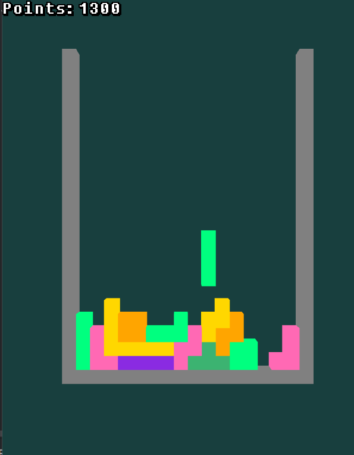

# 3D Tetris

---

3D Tetris is a "homemade copy" of the original Tetris game. 

This project utilises the [Threepp library](https://github.com/markaren/threepp), and was made for an exam 
in the course AIS1003 - "Object oriented programming for cyber physical systems".



In this version of Tetris the game board is a bit bigger than the original game, and the shapes, `tetrinos`, 
are in 3D and with new colours.
The points system is more simplified than the original, so you get 100 points for every `tetrino` you put down 
and 1200 for clearing a full row.
The KeyListener lets the player move and rotate the `tetrinos` in the game with these keys:

- A - Move left
- S - Move down
- D - Move right
- W - Rotate

## How to build

---

Since this project uses `threepp` to render, you will need to have [vcpkg](https://vcpkg.io/en/getting-started.html) 
installed and these lines in the CMake build profile:

```shell
-DCMAKE_TOOLCHAIN_FILE=[path to vcpkg]/scripts/buildsystems/vcpkg.cmake   # call CMake with this.
-DVCPKG_TARGET_TRIPLET=x64-mingw-[static|dynamic]  # choose either `static` or `dynamic`.
-DVCPKG_HOST_TRIPLET=x64-mingw-[static|dynamic]    # <-- needed only if MSVC cannot be found. 
```

## Current state

---

As of December 7th, 2023 the game is still a work in progress and I keep finding more and more to improve.
The game works great as long as you only clear one row at a time, and don't look at the colours after the 
first cleared row.

### Known bugs

- The logic behind works, but the rendering got complicated fast and only deletes boxes on the first full row.
So now, when you clear multiple rows at once, the new `tetrino` will continue to fall as many boxes as should have 
been cleared into the ones that are still there.

This is a rendering problem I'm still trying to figure out.
It could be fixed by instead of having two sets of the game board (one visual and one for logic),
to have only one and then a function which render the values in the grid that are `true`.

- Also, if you try to rotate at the border you are supposed to get pushed out again so that the `tetrino` won't 
rotate into it, but this works only sometimes.

The solution over would also fix this problem, since it then no longer can crash into itself 
(see comment in TetrisGame.cpp).

### Further improvements summarised

- Push back `tetrino` when rotated into the sidewalls of the border.
- Clear the rendered boxes of all completed rows if more than one row is cleared at once, not just the first.
- Have the new rendered boxes keep their supposed colour.
- Shadows for better 3D effect.

